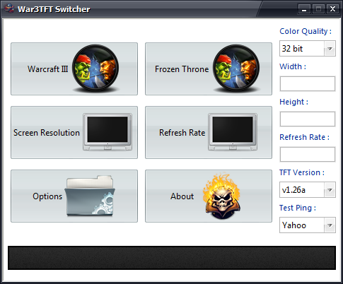
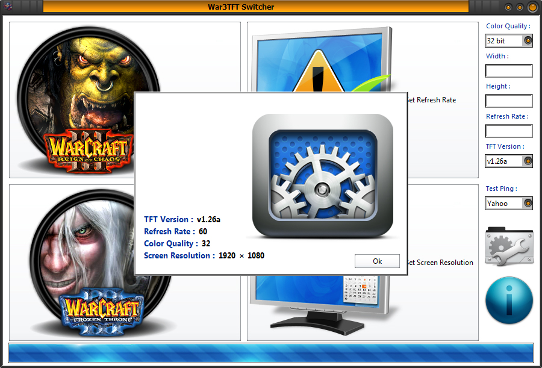

# War3TFT Switcher

## Overview
War3TFT Switcher is a legacy utility created to simplify version switching for **Warcraft III: The Frozen Throne** players on the Garena platform (garena.sg).  

Online players faced a major challenge: Garena required specific game versions, forcing users to maintain multiple full installations of Warcraft III. Existing free tools at the time moved **1.5–2 GB of data** per switch, taking **5–10 minutes** to complete.

To solve this, War3TFT Switcher was developed in **Visual Basic (VB)**, enabling version changes in **under 10 seconds** without duplicating entire game folders.

# Download
[War3TFT Switcher.exe - Google Drive](https://drive.google.com/file/d/1lWIxLE-E_4lz--xYVtnx-3v_16xdz4I6/view)

# Screenshots

---


---

## Features
- ⚡ **Fast switching** between Warcraft III versions (under 10 seconds)  
- 💾 **Lightweight solution** compared to other tools that required gigabytes of data movement  
- 🕹️ Designed specifically for **Garena online play**  
- 📅 Development period: **2009–2013**  

---

## Background
- Original source code was lost due to a hard drive failure  
- Only the compiled **EXE files** remain available  
- Successor game **Dota 2** is now available via Steam  

---

## Old Version-Screenshot
  

---

## Serials

```
57542ABBRQ292331YB4Q5A8I7
62448GUVTU715915ID2E8Y0J1
23203YGDEV119982OL6A3I2O4
98878IUYLW204482AD7T6N1D8
12835TQYMN251586EJ8Q2C4Q6

5XC6JVAJIU999134T1H760197
4IJ6SWGCIO834932B8Y023466
5FF2ELMMHK536193H5M868736
6KG8AKLBEP541610G0L627350
8NQ6NOBHAQ666260T8O320191

1L2K1537391EN0D18692FJPBM
1I5V1712482NU8A54464FMTAO
0R6O3562245BW7F19301QEKQQ
4G3U3957061UK1T67355LDNAA
0E6X8712670HC1W27536IQXIE

6O6C8120872PN6PJEMIA32402
5A5M8633594EG0QSENAC31652
5W6H8895017XX4VNDOUC24893
2T6V8649413VU7JOMIUU44436
4K1V4943794CK8RHUXLG34358

NYRRW667321DS8R984050N3U5
OIMJB181941BU7R308902H8N2
NDQIE353564RW2C338892J5D1
DPILF667978RQ1X464364R4T5
WFXJO340257JA3O931843X6T3
``` 

---