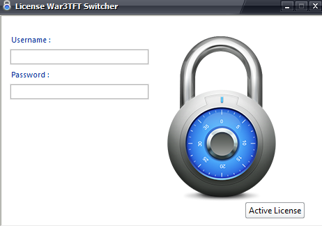

# War3TFT Switcher

[](LICENSE)
[](https://www.microsoft.com/windows)
[](https://en.wikipedia.org/wiki/Visual_Basic)
[](https://github.com/amirargani/War3TFT_Switcher)

## 📖 Overview
**War3TFT Switcher** is a legacy utility designed to simplify version switching for **Warcraft III: The Frozen Throne** players, specifically those using the Garena platform.

In the past, Garena required players to match specific game versions. This often meant maintaining multiple massive installations (1.5–2 GB each). Switching between them using standard tools could take 5–10 minutes. 

War3TFT Switcher solves this by enabling version changes in **under 10 seconds** without duplicating entire game folders, providing a lightweight and efficient solution for competitive play.

---

## 🚀 Key Features
- ⚡ **Ultra-Fast Switching**: Change versions in less than 10 seconds.
- 💾 **Storage Efficient**: Avoids duplicating gigabytes of game data.
- 🎯 **Garena Optimized**: Tailored for the specific needs of Garena online matchmaking.
- ⏳ **Historical Context**: Developed between **2009 and 2013**.

---

## 📥 Download
> [!IMPORTANT]
> This program **must be run as administrator** to function correctly.

- [**War3TFT Switcher Version 2013**](https://github.com/amirargani/War3TFT_Switcher/releases/tag/v2013)
- [**Alternative Download (Google Drive)**](https://drive.google.com/file/d/1lWIxLE-E_4lz--xYVtnx-3v_16xdz4I6/view)

---

## 🖼️ Screenshots

<div align="center">
  
  
  <br>
  <em>The modern interface of War3TFT Switcher (v2013)</em>
</div>

---

## 📜 Background & Legacy
- **Source Code**: The original source code was unfortunately lost due to a hardware failure. Only the compiled binaries remain.
- **Current Era**: While the game has evolved (and Dota 2 has moved to Steam), this tool remains a piece of history for the legacy WC3 community.
- **Classic Look**: Below is a look at the original classic version of the tool.

  
*Original Classic Interface*

---

## 🔑 Serials
<details>
<summary>Click to view provided serial keys</summary>

```text
57542ABBRQ292331YB4Q5A8I7
62448GUVTU715915ID2E8Y0J1
23203YGDEV119982OL6A3I2O4
98878IUYLW204482AD7T6N1D8
12835TQYMN251586EJ8Q2C4Q6

5XC6JVAJIU999134T1H760197
4IJ6SWGCIO834932B8Y023466
5FF2ELMMHK536193H5M868736
6KG8AKLBEP541610G0L627350
8NQ6NOBHAQ666260T8O320191

1L2K1537391EN0D18692FJPBM
1I5V1712482NU8A54464FMTAO
0R6O3562245BW7F19301QEKQQ
4G3U3957061UK1T67355LDNAA
0E6X8712670HC1W27536IQXIE

6O6C8120872PN6PJEMIA32402
5A5M8633594EG0QSENAC31652
5W6H8895017XX4VNDOUC24893
2T6V8649413VU7JOMIUU44436
4K1V4943794CK8RHUXLG34358

NYRRW667321DS8R984050N3U5
OIMJB181941BU7R308902H8N2
NDQIE353564RW2C338892J5D1
DPILF667978RQ1X464364R4T5
WFXJO340257JA3O931843X6T3
```
</details>

---
*Developed by Amir Argani*
